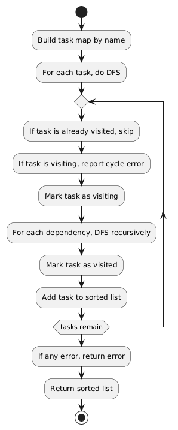

# jobforge

An OTP application for sorting and executing shell command tasks with dependencies.

## Features

- Accepts a list of tasks (with dependencies) via HTTP POST.
- Returns a sorted list of tasks in execution order (dependencies first).
- Detects and reports cycles in dependencies.
- Can return a bash script representation of the sorted commands.
- Efficient for large task graphs (tested up to 100,000 tasks).
- Comprehensive test suite.

## Architecture Overview

Jobforge is designed as a modular, extensible job processing system. At its core is a GenServer (`jobforge_job_server`) that manages job submission, scheduling, and execution. The job queueing mechanism is pluggable: by default, an in-memory queue is used, but you can swap in other backends (RabbitMQ, Kafka, etc.) with minimal changes.


*Figure: High-level component and workflow diagram of the Jobforge system.*

## Task Sorting Algorithm

Jobforge uses a custom topological sort implemented in the `task_sorter` module to order tasks based on their dependencies.

- Each task can specify a list of other tasks it depends on (`requires`).
- The sorter traverses the dependency graph using depth-first search (DFS).
- It detects cycles and missing dependencies, returning an error if found.
- The result is a list of tasks in the correct execution order, so that all dependencies are satisfied before a task runs.

### Example

If you submit these tasks:
- task-1 (no dependencies)
- task-2 (depends on task-3)
- task-3 (depends on task-1)

The sorted order will be: task-1, task-3, task-2.


*Figure: High-level detail of sorting algorithm

## Pluggable Backend

The job queueing mechanism is abstracted behind a backend interface. By default, an in-memory queue is used, but you can implement and configure other backends (e.g., RabbitMQ, Kafka, Redis Streams).

To add a new backend:
1. Implement the `jobforge_job_backend` behaviour.
2. Set the backend module in `jobforge_job_server` (see `init/1`).

Example backends:
- `jobforge_backend_queue` (default, in-memory)
- `jobforge_backend_pubsub` (demo/mock)
- `jobforge_backend_rabbit` (RabbitMQ, planned)


## Job State and Stats

You can introspect the job server's internal state (number of running, pending, completed, and total jobs) using the following API:

```erlang
jobforge_job_server:get_stats().
```
Returns a map like:
```erlang
#{pending_count => 0, running_count => 0, completed_count => 0, total_submitted => 0}
```


## Build & Run

### Prerequisites

- Erlang/OTP v26
- [rebar3](https://www.rebar3.org/) build tool

### Build

```sh
cd jobforge
rebar3 compile
```

### Run the Application

```sh
rebar3 shell
```

This will start the Cowboy HTTP server on port 8080.

---

## API Usage

### 1. Synchronous Job Sort (Immediate Result)

**Endpoint:**  
`POST http://localhost:8080/syncjob`

This endpoint accepts a list of tasks (with dependencies) and returns the sorted list immediately in the response.

**Request Body Example:**
```json
{
  "tasks": [
    { "name": "task-1", "command": "touch /tmp/file1", "requires": [] },
    { "name": "task-2", "command": "cat /tmp/file1", "requires": ["task-3"] },
    { "name": "task-3", "command": "echo 'Hello World!' > /tmp/file1", "requires": ["task-1"] },
    { "name": "task-4", "command": "rm /tmp/file1", "requires": ["task-2", "task-3"] }
  ]
}
```

**Curl Example:**
```sh
curl -X POST http://localhost:8080/syncjob \
  -H "Content-Type: application/json" \
  -d '{
    "tasks": [
      { "name": "task-1", "command": "touch /tmp/file1", "requires": [] },
      { "name": "task-2", "command": "cat /tmp/file1", "requires": ["task-3"] },
      { "name": "task-3", "command": "echo '\''Hello World!'\'' > /tmp/file1", "requires": ["task-1"] },
      { "name": "task-4", "command": "rm /tmp/file1", "requires": ["task-2", "task-3"] }
    ]
  }'
```

**Response Example:**
```json
[
  {"command": "touch /tmp/file1", "name": "task-1", "requires": []},
  {"command": "echo 'Hello World!' > /tmp/file1", "name": "task-3", "requires": ["task-1"]},
  {"command": "cat /tmp/file1", "name": "task-2", "requires": ["task-3"]},
  {"command": "rm /tmp/file1", "name": "task-4", "requires": ["task-2", "task-3"]}
]
```

*The response is a JSON array of the sorted tasks in execution order (dependencies first).*

### 2. Synchronous Job Sort (Bash Script Output)

**Endpoint:**  
`POST http://localhost:8080/syncjob/bash`

This endpoint accepts a list of tasks (with dependencies) and returns a bash script with the commands in the correct execution order.

**Request Body Example:**
```json
{
  "tasks": [
    { "name": "task-1", "command": "touch /tmp/file1", "requires": [] },
    { "name": "task-2", "command": "cat /tmp/file1", "requires": ["task-3"] },
    { "name": "task-3", "command": "echo 'Hello World!' > /tmp/file1", "requires": ["task-1"] },
    { "name": "task-4", "command": "rm /tmp/file1", "requires": ["task-2", "task-3"] }
  ]
}
```

**Curl Example:**
```sh
curl -X POST http://localhost:8080/syncjob/bash \
  -H "Content-Type: application/json" \
  -d '{
    "tasks": [
      { "name": "task-1", "command": "touch /tmp/file1", "requires": [] },
      { "name": "task-2", "command": "cat /tmp/file1", "requires": ["task-3"] },
      { "name": "task-3", "command": "echo '\''Hello World!'\'' > /tmp/file1", "requires": ["task-1"] },
      { "name": "task-4", "command": "rm /tmp/file1", "requires": ["task-2", "task-3"] }
    ]
  }'
```

**Response Example:**
```bash
rm /tmp/file1
cat /tmp/file1
echo 'Hello World!' > /tmp/file1
touch /tmp/file1
```

*The response is a bash script with the commands in the correct execution order, ready to be saved and run.*

### 3. Asynchronous Job Submission and Result Polling

**Endpoint to Submit Async Job:**  
`POST http://localhost:8080/asyncjob`

This endpoint accepts a list of tasks (with dependencies) and returns a job id for later polling.

**Request Body Example:**
```json
{
  "tasks": [
    { "name": "task-1", "command": "touch /tmp/file1", "requires": [] },
    { "name": "task-2", "command": "cat /tmp/file1", "requires": ["task-3"] },
    { "name": "task-3", "command": "echo 'Hello World!' > /tmp/file1", "requires": ["task-1"] },
    { "name": "task-4", "command": "rm /tmp/file1", "requires": ["task-2", "task-3"] }
  ]
}
```

**Curl Example:**
```sh
curl -X POST http://localhost:8080/asyncjob \
  -H "Content-Type: application/json" \
  -d '{
    "tasks": [
      { "name": "task-1", "command": "touch /tmp/file1", "requires": [] },
      { "name": "task-2", "command": "cat /tmp/file1", "requires": ["task-3"] },
      { "name": "task-3", "command": "echo '\''Hello World!'\'' > /tmp/file1", "requires": ["task-1"] },
      { "name": "task-4", "command": "rm /tmp/file1", "requires": ["task-2", "task-3"] }
    ]
  }'
```

**Response Example:**
```json
{
  "job_id": "eec40d42-e812-4ec2-b174-eedbec046e51"
}
```

---

**Endpoint to Poll for Async Job Result:**  
`GET http://localhost:8080/asyncjob/result/{job_id}`

**Curl Example:**
```sh
curl http://localhost:8080/asyncjob/result/eec40d42-e812-4ec2-b174-eedbec046e51
```

**Response Example (while running):**
```json
{
  "status": "running",
  "result": null
}
```

**Response Example (when done):**
```json
{
  "status": "done",
  "result":["rm /tmp/file1","cat /tmp/file1","echo 'Hello World!' > /tmp/file1","touch /tmp/file1"]
}
```

*The async API allows you to submit a job and poll for its result using the returned job id.*

## Performance & Load Testing

This project includes a large-scale test to demonstrate performance and scalability.

### Run the Large Test

To run the full test suite, including a test with 100,000 tasks:

```sh
rebar3 ct --readable=true
```

The large test will use cached/generated data and report the time taken to sort 100,000 tasks.

### Example Test Report

```
Loaded tasks from cache: /Users/gurwinder/Documents/Sort-Commands/jobforge/tmp/tasks_N100000_D3_Cfalse.json
* User 2025-07-02 17:45:08.624 *
Generated Tasks List of length 100000
* User 2025-07-02 17:45:08.932 *
Time taken: 307ms
=== successfully completed test case
=== Returned value: ok
```


- The test suite will print the time taken for the large acyclic sort.
- All test logs and reports are available in `_build/test/logs/`.

### Latest Test Results

For convenience, the latest test log output is also available in [`test/reports/`](test/reports/) (if you copy or symlink the latest log there).

---

## Test Output Location

- All Common Test logs are written to `_build/test/logs/`.
- You can view detailed HTML and text reports there after running the tests.

---
# jobforge-erl
